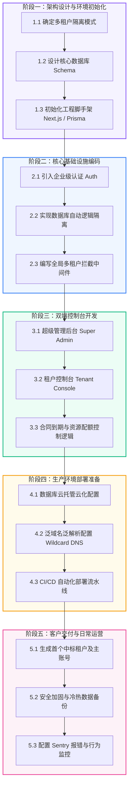

# SaaS 系统研发、部署与交付全生命周期指南 (线下招标版)

本指南旨在从**工程落地、系统架构、CI/CD 部署、多租户设计、安全隔离与客户交付**等维度，全景式地介绍如何从零开发并发布一套 B2B/B2G 级别的 SaaS 系统。

---

## 🗺️ 全生命周期路线图 (Roadmap)



---

## 🛠️ 第一阶段：架构设计与环境初始化

### 1. 确定多租户隔离设计
B2B/B2G 场景的核心是数据安全。我们优先推荐 **逻辑隔离模式（共享数据库，字段隔离）**，其开发效率与运维成本最优。

### 2. 设计核心数据库 Schema (Prisma 关系示例)
核心实体包括：**租户 (Tenant)**、**用户 (User)**、**合同控制 (Contract)**。

```prisma
// schema.prisma

datasource db {
  provider = "postgresql"
  url      = env("DATABASE_URL")
}

generator client {
  provider = "prisma-client-js"
}

// 1. 租户实体（每个中标的客户公司是一个租户）
model Tenant {
  id               String         @id @default(uuid())
  name             String         // 客户公司全称
  companyCode      String         @unique // 企业唯一识别码（用于登录或二级域名前缀）
  status           TenantStatus   @default(ACTIVE) // 状态：ACTIVE, DISABLED
  
  // 合同信息
  contractStart    DateTime
  contractEnd      DateTime
  
  // 资源配额限制
  maxUsers         Int            @default(50) // 最大子账号数
  maxStorageGb     Float          @default(10.0) // 存储限额 (GB)
  
  // 关联
  users            User[]
  createdAt        DateTime       @default(now())
  updatedAt        DateTime       @updatedAt
}

enum TenantStatus {
  ACTIVE
  DISABLED
}

// 2. 用户实体 (支持租户内多用户)
model User {
  id            String    @id @default(uuid())
  email         String    @unique
  name          String?
  passwordHash  String    // 密码哈希
  role          UserRole  @default(MEMBER) // 角色：SUPER_ADMIN(平台运营), TENANT_ADMIN(客户主管理员), MEMBER(客户员工)
  
  tenantId      String?   // 超管无 tenantId，租户用户必须绑定 tenantId
  tenant        Tenant?   @relation(fields: [tenantId], references: [id], onDelete: Cascade)
  
  createdAt     DateTime  @default(now())
  updatedAt     DateTime  @updatedAt
}

enum UserRole {
  SUPER_ADMIN
  TENANT_ADMIN
  MEMBER
}
```

### 3. 初始化工程脚手架
1. 初始化项目：`npx create-next-app@latest my-saas-app --typescript --tailwind --app`
2. 安装 Prisma 和客户端：`npm install prisma @prisma/client`
3. 初始化 Prisma 配置：`npx prisma init`
4. 将上述 Schema 写入 `prisma/schema.prisma`，然后执行数据库迁移：
   `npx prisma migrate dev --name init_tenants`

---

## ⚙️ 第二阶段：核心基础设施编码

### 1. 引入企业级身份认证 (Authentication)
*   **自建认证**：采用 `NextAuth.js` 或库 `bcryptjs` + `jose`（JWT）。
*   **设计多租户登录逻辑**：
    *   用户输入邮箱/账号 and 密码。
    *   后台验证密码成功后，读取其关联的 `tenantId`，并将 `tenantId`、`role`、`companyCode` 写入加密的 JWT Cookie 或 Session。

### 2. 数据库逻辑隔离实现 (Prisma 拦截器)
为了防止开发人员在编写业务 SQL 时忘记加上 `WHERE tenantId = ...` 导致数据越权泄露，可以通过 Prisma 拦截器进行全局拦截：

```typescript
// prisma.ts
import { PrismaClient } from '@prisma/client'

const prisma = new PrismaClient()

// 注入只读拦截中间件（只针对租户账号）
prisma.$use(async (params, next) => {
  // 如果是查询/更新操作，且当前上下文有租户信息
  // 可以在这里动态修改 params.args.where，强制拼装 tenantId
  return next(params)
})

export default prisma;
```

### 3. 编写全局路由与状态拦截中间件
在 Next.js 的 `middleware.ts` 中，拦截所有非法、过期或停用的租户请求：

```typescript
// middleware.ts
import { NextResponse } from 'next/server'
import type { NextRequest } from 'next/server'
import { jwtVerify } from 'jose'

export async function middleware(request: NextRequest) {
  const token = request.cookies.get('session-token')?.value
  
  // 1. 无 token 拦截至登录页
  if (!token) {
    if (request.nextUrl.pathname.startsWith('/app') || request.nextUrl.pathname.startsWith('/admin')) {
      return NextResponse.redirect(new URL('/login', request.url))
    }
    return NextResponse.next()
  }

  try {
    const secret = new TextEncoder().encode(process.env.JWT_SECRET)
    const { payload } = await jwtVerify(token, secret)
    
    const role = payload.role as string
    const tenantStatus = payload.tenantStatus as string
    const contractEnd = new Date(payload.contractEnd as string)
    const today = new Date()

    // 2. 超级管理后台权限校验
    if (request.nextUrl.pathname.startsWith('/admin') && role !== 'SUPER_ADMIN') {
      return NextResponse.redirect(new URL('/403', request.url))
    }

    // 3. 租户被禁用拦截
    if (role !== 'SUPER_ADMIN' && tenantStatus === 'DISABLED') {
      return NextResponse.redirect(new URL('/tenant-blocked', request.url))
    }

    // 4. 合同过期拦截（阻断非 GET 的写入操作）
    if (role !== 'SUPER_ADMIN' && today > contractEnd) {
      if (request.method !== 'GET') {
        return new NextResponse(
          JSON.stringify({ error: '您的使用合同已到期，系统已切换至只读模式，请联系运营方续签。' }),
          { status: 403, headers: { 'content-type': 'application/json' } }
        )
      }
    }
  } catch (err) {
    return NextResponse.redirect(new URL('/login', request.url))
  }

  return NextResponse.next()
}
```

---

## 🖥️ 第三阶段：双端控制台编码

### 1. 超级管理后台 (Super Admin)
*   **页面路径**：`/admin/tenants`
*   **核心 UI 界面**：
    *   **租户列表看板**：显示所有客户公司名称、合同状态（正常/已过期）、当前账号使用数/最大账号配额。
    *   **开户配置弹窗**：手动输入新中标客户的“公司名称”、“系统三字码/前缀”（如 `ruixin`）、“合同开始/结束时间”、“最大账号上限”。
    *   **初始密码发放**：自动生成一个 `Admin` 账号（密码为随机强密码，生成后仅显示一次或通过邮件发送）。

### 2. 租户控制台 (Tenant Console)
*   **页面路径**：`/app/dashboard`
*   **核心 UI 界面**：
    *   **数据大屏/工作台**：根据你的核心 SaaS 业务线展示功能卡片。
    *   **成员管理页 (`/app/settings/members`)**：
        *   允许当前客户的 `TENANT_ADMIN`（主管理员）新增员工账号。
        *   **配额检查代码**：
          ```typescript
          // api/members/route.ts
          const currentCount = await prisma.user.count({ where: { tenantId } })
          const tenant = await prisma.tenant.findUnique({ where: { id: tenantId } })
          
          if (currentCount >= tenant.maxUsers) {
            return NextResponse.json({ error: '已达到该租户合同规定的账号数量上限，无法新增。' }, { status: 400 })
          }
          ```

---

## 🌐 第四阶段：生产环境部署准备

线下招标模式的 SaaS 系统需要满足高稳定性和国内网络合规要求。

### 1. 数据库云托管选型
*   **首选方案**：选用腾讯云、阿里云的 **RDS PostgreSQL**，并配置“自动每日备份”与“跨可用区容灾”。
*   **备选方案**：使用 Serveless 数据库 **Neon**，支持按需缩容。

### 2. 域名解析与泛域名配置 (Wildcard DNS)
为了让租户拥有独立域名的体验，可以使用泛域名机制：
1.  **域名解析**：在阿里云解析后台添加一条 `A` 记录：
    *   主机记录：`*`
    *   记录值：指向你部署 of SaaS 平台服务器 IP。
2.  **配置 Nginx 或 Vercel**：
    *   配置服务器允许接收所有来自 `*.yoursaas.com` 的请求。
    *   代码中通过 `request.headers.get('host')` 获取当前访问的域名，截取前缀：
        *   例如：访问 `ruixin.yoursaas.com`，截取前缀 `ruixin`。
        *   通过 `ruixin` 在数据库中匹配 `companyCode = 'ruixin'` 的租户，载入对应的数据。

### 3. CI/CD 自动化部署流水线 (GitHub Actions 示例)
在项目根目录下创建 `.github/workflows/deploy.yml`：

```yaml
name: Production Deployment

on:
  push:
    branches:
      - main

jobs:
  deploy:
    runs-on: ubuntu-latest
    steps:
      - name: Checkout Code
        uses: actions/checkout@v3

      - name: Setup Node.js
        uses: actions/setup-node@v3
        with:
          node-size: 18
          cache: 'npm'

      - name: Install Dependencies
        run: npm ci

      - name: Build Project & Compile Prisma Client
        env:
          DATABASE_URL: ${{ secrets.DATABASE_URL }}
          JWT_SECRET: ${{ secrets.JWT_SECRET }}
        run: |
          npx prisma generate
          npm run build

      - name: Deploy to Server (SSH/Docker/Vercel)
        # 这里可以使用 rsync 将构建产物传输至你中标项目指定的云服务器上，或通过 Docker 容器部署
        run: echo "部署完成"
```

---

## 🤝 第五阶段：客户交付与运营维护

当所有系统开发完成，进入真正的项目交付阶段：

### 1. 标准化客户开通步骤
1.  **线下流程**：
    *   确认客户付款及盖章合同。
    *   记录合同要素：租户名（如“瑞信科技”）、有效期（2026-05-29 至 2027-05-29）、配额（50人 / 100GB）。
2.  **系统录入**：
    *   超级管理员登录 `yoursaas.com/admin`。
    *   新建租户：输入企业名称和设定的缩写前缀（如 `ruixin`）。
    *   生成主管理员账号：`admin@ruixin.yoursaas.com`，初始密码 `Rx@889977`。
3.  **正式交付**：
    *   打印《系统开通交付确认书》，交付给客户方对接人。
    *   交付网址：`https://ruixin.yoursaas.com`。

### 2. 运维与监控
*   **异常监控**：在前端和后端接入 **Sentry**，自动拦截未捕获的 Error。
*   **数据冷备份**：
    *   编写一个简单的 Cron 脚本，每天定时将 RDS PostgreSQL 的物理/逻辑备份文件（`.sql`）加密打包，并上传至独立的对象存储（OSS）中隔离保存。
*   **安全合规**：
    *   如果是国内政企客户，必须在工信部完成**网站域名 ICP 备案**以及**公安联网备案**。
    *   定期进行端口扫描和简单的 SQL 注入渗透测试。
