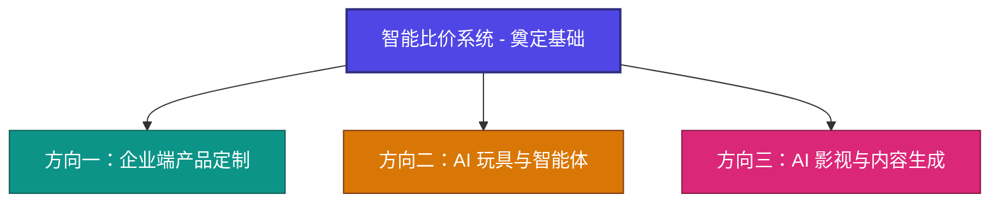

# 新型 AI 科技创业公司：定位、项目与未来愿景

欢迎加入我们！这是一份针对未来核心创业伙伴与团队成员的简要介绍文档。我们致力于利用最前沿的人工智能技术，解决真实商业场景中的痛点，并逐步探索 AI 在消费端与数字娱乐领域的无限可能。

---

## 一、 公司愿景与定位

我们是一家技术驱动、商业导向的 AI 科技创新企业。我们不追求空中楼阁的宏大叙事，而是立足于**“技术落地商业，场景创造价值”**的原则。

从高频、刚需的 B 端企业级效率工具切入，打磨技术与商业闭环；同时，积极布局消费级 AI 硬件（智能体）与前沿内容生成（AI 影视），构建横跨“企业服务”、“智能硬件”与“文化娱乐”的 AI 生态版图。

---

## 二、 核心启动项目：智能比价系统

公司的第一个拳头产品是**智能采购比价系统**。

### 1. 行业痛点
传统的企业采购比价流程存在高度的信息不对称与低效：
*   供应商报价格式千差万别（PDF、Excel、图片等），整理耗时耗力。
*   比价规则繁琐（需考虑账期、税率、运费、历史价格等），极度依赖人工经验。
*   比价过程缺乏系统化沉淀，采购决策难以优化。

### 2. 我们的解决方案
通过集成大语言模型（LLM）与多模态解析能力，打造智能采购比价系统：
*   **智能报价解析**：自动提取非结构化报价单数据，实现秒级录入与标准化。
*   **多维度自动比价**：结合税率、账期、运费等参数进行智能测算，提供多方案推荐。
*   **供应商画像与智能推荐**：基于历史数据，辅助采购人员做出最优决策。
*   **数据协同与看板**：为管理层提供全透明的采购成本分析。

### 3. 项目战略意义
作为公司的冷启动项目，智能比价系统直接面对高壁垒的 B 端市场，具备极强的变现能力与客户粘性。它不仅是公司早期的“现金牛”，更是我们磨练团队、沉淀底层 AI 基础设施的试金石。

---

## 三、 未来三大战略发展方向

在智能比价系统稳定运行并跑通商业模式后，公司将沿着以下三个核心方向进行纵深布局：

### 1. 针对企业端做产品定制 (Enterprise Customization)
*   **规划**：依托智能比价系统沉淀的 AI 数据解析、逻辑推理及流式处理能力，向其他垂直行业的企业客户延伸。
*   **目标**：针对中大型企业、垂直行业龙头，提供深度的 AI + 业务流程定制（如智能财务审计、供应链大模型等），输出高客单价、高壁垒的私有化/混合云 AI 解决方案。

### 2. 针对 AI 玩具做智能体 (AI Toys & Agentic Systems)
*   **规划**：将大模型与硬件结合，探索 AI 智能体（Agent）在消费电子及儿童教育/娱乐场景的落地。
*   **目标**：开发具备个性化记忆、多模态感知、自适应对话能力的 AI 玩具及智能交互硬件。让 AI 走出屏幕，成为有温度、有交互性的实体伴侣，卡位下一代人机交互的入口。

### 3. AI 影视与数字娱乐 (AI Cinema & AIGC Video)
*   **规划**：密切跟进并应用最前沿的 AI 视频生成（如 Sora、Luma、Suno 等）和图像生成技术，变革影视创作流程。
*   **目标**：开发辅助编剧、概念设计、AI 分镜及快速视频生成的工具或工作流，降低高质量内容创作的成本与门槛。未来计划孵化 AI 原生短剧、虚拟偶像或互动式数字娱乐内容，探索全新的文化消费场景。

---

## 四、 财务背景与产业资源

充足的资金和深厚的产业资源是我们创业起步及后续腾飞的双重保障。

### 1. 天使轮/种子轮：产业资源型资金注入
*   **投资背景**：首期投资人深耕**厦门及海西地区建筑行业二三十年**，拥有极为深厚的福建、潮汕地区产业网络。
*   **资金约定**：首期约定投资金额**不低于 100 万元人民币**。
*   **资源优势**：建筑与大宗商品采购是智能比价系统的天然肥沃土壤。投资人带来的福建、潮汕建筑上下游及供应链资源，将作为我们第一批种子客户与联创测试基地，帮助产品以极低成本快速跑通 commercial validation（商业验证）。

### 2. 第二阶段：国企及战略投资对接（第二年规划）
*   **目标规划**：在第一年内跑通主营业务、形成标杆案例与初步营收数据。
*   **资本储备**：目前已与**泉州和深圳等地的国企投资机构**建立对接渠道。
*   **融资策略**：第二年，随着产品形态成熟、业务规模扩大，我们将适时引入这些国企及大湾区的战略投资，这不仅能带来更大规模的资金，更能直接对接两地的国企采购供应链、智慧城市及公共服务资源，完成从本地化创业到跨区域集团化发展的跨越。

---

## 五、 我们在寻找怎样的伙伴？

我们不仅在招聘员工，更在寻找共同披荆斩棘的合伙人与核心团队成员。我们希望你：
1.  **结果导向，拥抱变化**：创业充满变数，我们看重解决实际问题的能力，而非堆砌概念。
2.  **对 AI 满怀热忱**：不仅会用工具，更对 AI 的未来变革充满好奇，有持续自我迭代的学习力。
3.  **务实精神**：愿意沉下心来，将复杂的 AI 技术转化为简单易用、能帮客户省钱挣钱的产品。

---

> **“在巨变的时代，最稳妥的做法就是与创造未来的人同行。”**
> 如果你对这个结合了“踏实落地”与“仰望星空”的业务蓝图感兴趣，欢迎加入我们，共同开启这段精彩的创业旅程！
