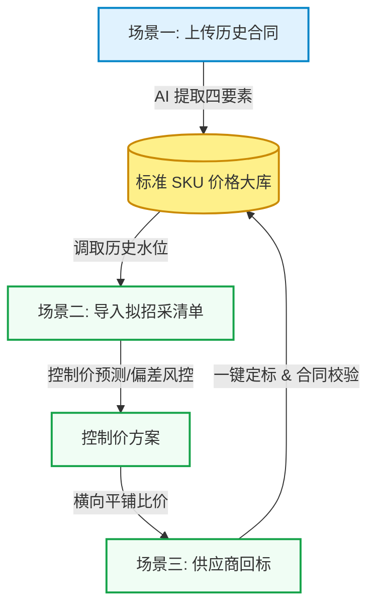

## 一、 文档概述

### 1.1 核心痛点与产品定位
针对工程供应链采购中物料“名称规格错乱、非标化严重”导致的核对难、比价慢问题 ，产品聚焦于最纯粹的数据结构化提取**与**价格直接对比 ，协助企业快速建立材料库，实现招采前的成本预测及招采后的高效回标比价 。

### 1.2 核心业务数据闭环
![[Pasted image 20260521182724.png]]

系统通过以下三个基础业务场景建立数据资产的自循环 ：

1. **场景 1（建库）：** 上传历史合同，通过 AI 提取清单明细，生成并喂养标准 SKU 材料价格库 。并同步生成合同库、供应商库、项目库。
    
2. **场景 2（预测）：** 招标前导入自身的无价招采清单，调取大库历史价格进行纵向成本预测 。
    
3. **场景 3（决策）：** 招标后导入供应商回标文件（兼容单家与多家），横向平铺对比并纵向参考大库，定标后中标价自动回传更新大库 。
    

## 二、 功能页面功能点清单

系统整体采用**简洁、清晰的工程 B 端产品设计风格**，避免复杂的嵌套。UI 布局采用列表格栅化展示，配合轻量级侧滑详情页或页签切换，注重数据流转的连贯性。

### 2.1 ：合同信息提取
- **目的**：将线下采购合同原件通过 AI 快速解析结构化，作为合同资产与物料价格大库的输入源。
- **页面布局**：双栏简约设计。左侧为合同原件（PDF/Excel）预览器，右侧为 AI 提取结果比对工作区，底部常驻【保存并入库】按钮。
- **核心功能点**：
    - **单合同导入与直存**：支持选择单个合同文件，AI 自动解析。用户在右侧工作区核对无误并确认 SKU 映射后，点击【保存并入库】，该合同以**“已生效”**状态写入合同库，其材料单价即刻写入大库价格水位。
    - **ZIP 批量导入**：支持上传合同压缩包。系统根据匹配规则批量导入合同库，状态设为**“待审核”**，其材料单价暂不写入大库。导入完成后自动跳转至【合同管理】页面以供用户逐一审核。
    - **要素识别提取**：AI 自动提取合同基本信息（编码、名称、供应商、项目、日期、金额、税率）及物资清单明细（名称、品牌、规格型号、单位、单价、数量）。
    - **联动高亮交互**：点击右侧明细行，左侧 PDF 对应区域高亮定位。

### 2.2 ：合同管理
- **目的**：集中展示和维护系统内所有已导入的合同，对履约物资进行追踪，并支持对批量导入合同的审核确认。
- **页面布局**：
    - **合同列表**：极简表格。支持模糊搜索合同名称、编码、供应商，支持按状态（待审核、已生效、已结清）进行筛选。
    - **合同详情页**：采用**双页签（Tabs）结构**：
        1. **“合同信息”页签**：展示合同基础元数据。
        2. **“合同材料清单”页签**：展示材料名称、品牌、规格、单位、数量、单价、合价及关联大库 SKU。
- **增删改查 (CRUD) 与审核规则**：
    - **新增/编辑/删除**：支持常规合同表单的新建、编辑和删除。
    - **审核确认流（核心）**：
        - 针对状态为**“待审核”**的合同（由 ZIP 批量导入生成），详情页顶部提供醒目的【审核确认】按钮。
        - 用户核对明细无误后点击【审核确认】，合同状态变更为**“已生效”**。此时，该合同包含的物资价格才会正式写入大库标准 SKU 价格流水中，更新水位。
    - **级联删除防污染**：删除合同将同步清理价格大库流水记录，并重新计算标准 SKU 水位。

### 2.3 ：招采清单
- **目的**：招标前管理并预测拟采购物资的成本，为招标控制价的制定提供决策依据。
- **页面布局**：
    - **清单列表**：以项目或招采批次维度展示招采清单，支持增删改查。
    - **清单详情**：穿透展示拟招采物资明细表（物料、数量、预估控制单价等），支持编辑调整。
- **核心功能点**：
    - **导入/导出**：支持标准 Excel 模板导入生成招采清单，支持将调整好的控制价清单导出。
    - **成本预测与预警**：调取大库历史成交最低价、近 30 天均价进行比对，对偏差率超标项（如 $>+15\%$ 或 $<-20\%$）进行警示。

### 2.4 ：回标管理
- **目的**：管理多家供应商的投标/回标报价，进行横向对比与中标定标。
- **页面布局**：
    - **回标记录列表**：展示历史回标项目，支持增删改查。
    - **回标详情页**：支持多供应商报价横向并排平铺对比（矩阵大表），高亮最低价。
- **核心功能点**：
    - **招采清单关联性**：新增回标记录时，**可选择关联已有的【招采清单】进行对标，也可不关联独立录入**。
    - **导入/导出**：支持导入供应商报价 Excel，自动完成表头及物料对齐；支持导出比价结果矩阵。
    - **一键定标与数据回写**：确认中标商后，其中标价自动回写至价格大库（待签约状态），等正式合同上传校验一致后转为已签约，完成数据闭环。

### 2.5 ：AI 小助理
- **目的**：通过轻量化对话窗口，协助管理人员通过自然语言快速查询大库价格水位和风险分析。
- **页面布局**：右下角常驻悬浮窗，点击打开毛玻璃面板，不遮挡主操作区。
- **核心功能点**：
    - **价格研判查询**：输入物料关键词，返回大库近30天均价、历史低价及最近一笔成交详情。
    - **风险扫描分析**：汇总反馈当前招采或回标中偏离度异常的高风险物料列表。

---

> **设计原则：简洁、实用、敏捷**。剔除冗余流程，采用列表格栅化展示与侧滑交互，提高预算员比价核对效率。

![[Pasted image 20260522115515.png]]
